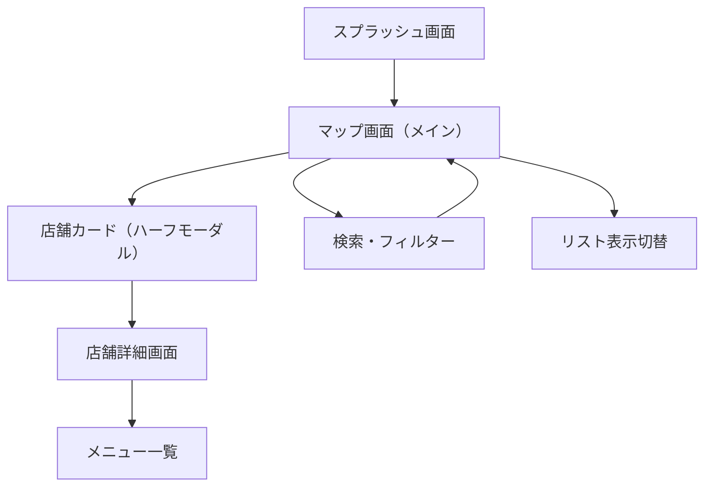
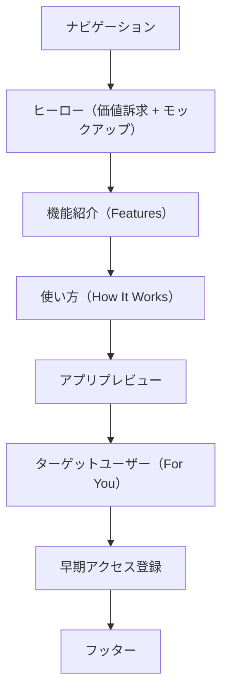
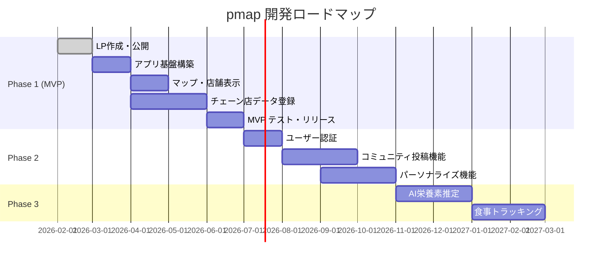

# pmap - 要件定義書

> **外食でもプロテインを妥協しない。**
>
> Google Mapsベースで周辺飲食店メニューのプロテイン（タンパク質）量を可視化するマップアプリ。
> 筋トレ・ダイエット中のユーザーが外食時にタンパク質を意識した食事選びをサポートする。

---

## 1. プロダクト概要

| 項目 | 内容 |
|---|---|
| **アプリ名** | pmap（protein + map） |
| **プラットフォーム** | ネイティブアプリ（iOS/Android）+ ランディングページ（LP） |
| **初期対象エリア** | 東京・新宿 → 東京全域 → 全国展開 |
| **リリース予定** | 2026年 |
| **価格** | 基本無料（フリーミアム） |

---

## 2. 海外の類似サービス分析

pmapは既存サービスの良い部分を取り入れつつ、**「マップ × プロテイン特化」** という独自ポジションを狙う。

| アプリ名 | 主な特徴 | pmapへの示唆 |
|---|---|---|
| **ProteinMax: Gains Eating Out** | 近くのレストランの高プロテインメニューを検索・発見（iOS） | 最も近い競合。プロテイン特化だがマップUI弱め。pmapはマップ体験で差別化 |
| **Meal Map Nutrition** | インタラクティブマップで飲食店を発見、カロリー・プロテイン・炭水化物を表示 | マップ＋栄養素の組み合わせ。UIの参考 |
| **MenuFit** | AIでメニュー写真を解析し栄養素を推定。22.3M以上のレストランをカバー | AI解析アプローチが参考。メニュー写真→栄養素推定 |
| **CalorieCap** | カロリー制限に沿った外食メニューを検索。「High Protein」フィルターあり | フィルター機能・マクロ栄養素表示の参考 |
| **MyFitnessPal** | 2,050万以上の食品DB。レストランメニューも多数収録 | 食品DBの規模感が参考。マップ体験はなし |

> [!IMPORTANT]
> **pmapの差別化ポイント**: 既存アプリは「栄養トラッキング」が主軸。マップ上で直感的に「この辺でプロテインが多い店どこ？」と探せる体験は弱い。pmapは**Google Mapsライクなマップ体験をコアに、プロテイン量で飲食店を色分け・ランキング**する。

---

## 3. ターゲットユーザー

| ペルソナ | 詳細 |
|---|---|
| **メイン** | 筋トレ・ボディメイク中の20〜40代男女。外食時にタンパク質摂取量を気にしている |
| **サブ1** | ダイエット中のユーザー。高タンパク＆低カロリーな外食先を探したい |
| **サブ2** | アスリート・トレーナー。選手やクライアントに外食先を推薦したい |

---

## 4. コア機能要件

### 4.1 マップ表示（MVP必須）

- React Native Maps（Google Maps）を使用したマップ表示
- **初期エリア：東京・新宿エリアに集中**（→ 段階的に東京全域 → 全国展開）
- 現在地周辺の飲食店をマップ上にピン表示
- **プロテインスコアに応じたピンの色分け**
  - 🟢 高プロテインメニューあり（30g以上/食）
  - 🟡 中程度（15〜30g/食）
  - 🔴 低プロテイン（15g未満/食）
- ピンタップで店舗カード表示（店名、代表的な高プロテインメニュー、最高プロテイン量）

### 4.2 店舗・メニュー詳細

- 店舗詳細ページ：住所、営業時間、Google Maps評価、電話番号
- メニュー一覧：**プロテイン量の多い順にデフォルトソート**
- 各メニューの栄養情報表示：
  - タンパク質（メイン）
  - カロリー
  - 脂質・炭水化物（サブ表示）
- メニュー写真（ある場合）

### 4.3 検索・フィルター

- 現在地 or 指定エリアでの検索
- プロテイン量の最低ラインフィルター（例：30g以上のメニューがある店のみ）
- ジャンルフィルター（和食、中華、洋食、ファストフード、コンビニ等）
- 価格帯フィルター
- 営業中フィルター

### 4.4 表示切替

- マップ表示 ⇄ リスト表示の切替
- リスト表示ではプロテイン量の多い順にソート可能

### 4.5 栄養データの取得方法

> [!WARNING]
> 栄養データの収集方法はプロジェクトの成否を左右する最重要課題。以下の段階的アプローチで進める。

| フェーズ | データソース | 説明 |
|---|---|---|
| **Phase 1（MVP）** | 大手チェーン店の公式栄養情報 | 多くの大手チェーンは公式サイトで栄養成分を公開。スクレイピング or 手動登録 |
| **Phase 2** | ユーザー投稿（CGM） | ユーザーがメニューの栄養情報を投稿・編集できる仕組み（Wikipedia的モデル） |
| **Phase 3** | AI推定 | MenuFitのようにメニュー写真や料理名からAIでプロテイン量を推定 |

---

## 5. 追加機能（Phase 2以降）

### 5.1 パーソナライズ
- 1日の目標プロテイン量の設定
- 残り必要プロテイン量に応じたレコメンド（「あと30g必要 → この店のこのメニュー」）
- お気に入り店舗・メニューの保存

### 5.2 ソーシャル機能
- メニューの栄養情報の投稿・修正（コミュニティ貢献）
- 高プロテインメニューのレビュー・評価
- 「プロテインチャレンジ」等のゲーミフィケーション

### 5.3 AI機能
- メニュー写真からの栄養素自動推定
- 食事記録からの1日のプロテイン摂取量トラッキング
- パーソナライズされたメニュー提案

---

## 6. 技術スタック

### 6.1 ネイティブアプリ

| レイヤー | 技術 | 理由 |
|---|---|---|
| **フレームワーク** | React Native + Expo | iOS/Android同時開発、Expoで開発体験が良い |
| **マップ** | react-native-maps + Google Places API | ネイティブマップ体験 + 飲食店データ取得 |
| **バックエンド** | Supabase | 認証、DB、Storageを一括管理。開発速度重視 |
| **DB** | PostgreSQL（Supabase） | 位置情報クエリ（PostGIS）に対応 |
| **AI推定** | Google Gemini API | メニュー写真解析、栄養素推定（Phase 3） |
| **ストア配信** | EAS Build（Expo） | OTAアップデート対応 |

### 6.2 ランディングページ（LP）

| レイヤー | 技術 | 理由 |
|---|---|---|
| **構成** | HTML / CSS / JavaScript | LP単体なので軽量。高速表示 |
| **デプロイ** | Vercel | 高速、無料枠あり |
| **フォント** | Inter + Noto Sans JP | モダンで読みやすい |
| **デザイン** | ダークモード、グラデーション、アニメーション | 高品質なファーストインプレッション |

---

## 7. MVP（最小限の製品）スコープ

**対象エリア：東京・新宿**

### 7.1 ネイティブアプリ（MVP）

- [ ] React Native + Expo プロジェクトセットアップ
- [ ] Google Mapsベースのマップ表示（react-native-maps）
- [ ] 新宿エリアの飲食店表示
- [ ] 大手チェーン店のプロテイン情報表示（新宿エリアの主要チェーン）
- [ ] プロテイン量による色分けピン
- [ ] 店舗タップで詳細表示（ハーフモーダル）
- [ ] メニューのプロテイン量ソート
- [ ] プロテイン量のフィルター検索
- [ ] ~~ユーザー認証~~ → Phase 2
- [ ] ~~ユーザー投稿~~ → Phase 2
- [ ] ~~AI推定~~ → Phase 3

### 7.2 ランディングページ（MVP）

- [x] ヒーローセクション（アプリの価値訴求 + アプリモックアップ画像）
- [x] 機能紹介セクション（プロテインマップ、スマート検索、栄養素表示、リスト表示、瞬時に判断）
- [x] 使い方セクション（3ステップ：マップを開く → お店をタップ → 高プロテインを選ぶ）
- [x] アプリプレビューセクション
- [x] ターゲットユーザーセクション
- [x] 早期アクセス登録フォーム（メールアドレス入力）
- [x] フッター（プロダクト・サポート・SNSリンク）
- [ ] Vercelへのデプロイ
- [ ] App Store / Google Play リンク追加（アプリリリース後）

---

## 8. 画面構成

### 8.1 ネイティブアプリ

| 画面 | 概要 |
|---|---|
| スプラッシュ | ロゴ + ローディング |
| マップ画面（メイン） | 新宿エリアにフォーカス、プロテインスコア色分けピン |
| 店舗カード | ピンタップで表示されるハーフモーダル |
| 店舗詳細 | メニュー一覧とプロテイン情報 |
| 検索/フィルター | プロテイン量・ジャンル・距離で絞り込み |
| リスト表示 | マップ⇄リストの切替表示 |

### 8.2 ランディングページ

---

## 9. ビジネスモデル（案）

| モデル | 内容 |
|---|---|
| **フリーミアム** | 基本機能は無料。詳細フィルター・お気に入り保存・AI推定をプレミアムに |
| **広告** | 飲食店からの広告掲載（高プロテインメニューの特別ピン表示等） |
| **飲食店向けB2B** | 栄養情報の掲載管理ダッシュボード（月額課金） |

---

## 10. 開発フェーズ

---

## 11. 現在の進捗状況

| 成果物 | ステータス | 備考 |
|---|---|---|
| **ランディングページ** | ✅ 完成 | `index.html` / `style.css` / `script.js` / `app_mockup.png` |
| **ネイティブアプリ** | 🔲 未着手 | React Native + Expo で開発予定 |
| **バックエンド** | 🔲 未着手 | Supabase を使用予定 |
| **栄養データ** | 🔲 未着手 | 新宿エリアの大手チェーン店から開始 |

---

## 12. 確定事項

| 項目 | 決定内容 |
|---|---|
| **プラットフォーム** | ネイティブアプリ（React Native + Expo）+ LP |
| **初期対象エリア** | 東京・新宿 → 東京全域 → 全国 |
| **データ収集** | 大手チェーン店の公式栄養情報からスタート |
| **アプリ名** | pmap（protein + map） |
| **LP技術** | HTML / CSS / JS（軽量構成） |
| **デプロイ先** | Vercel（LP）、EAS Build（アプリ） |
